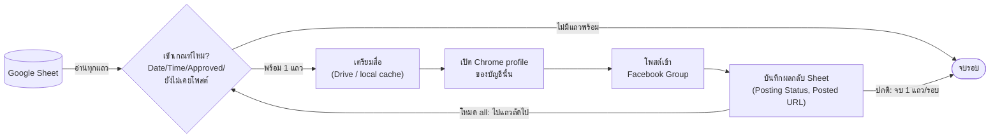

# Facebook Sheet Autoposter


โปรแกรม Windows สำหรับอ่าน Google Sheet ทุกรอบตามเวลาที่ตั้งไว้ และเผยแพร่ไปยัง Facebook Group ตามข้อมูลในชีต — ทีละแถว ปลอดภัยไว้ก่อน

## สารบัญ

- [ข้อจำกัดที่ต้องรู้](#ข้อจำกัดที่ต้องรู้)
- [ระบบทำงานยังไง](#ระบบทำงานยังไง)
- [พฤติกรรมสำคัญ](#พฤติกรรมสำคัญ)
- [เครื่องใหม่: ติดตั้งเร็วสุด](#เครื่องใหม่-ติดตั้งเร็วสุด)
- [1. ติดตั้ง (แบบละเอียด)](#1-ติดตั้ง-แบบละเอียด)
- [2. เชื่อม Google](#2-เชื่อม-google)
- [3. ล็อกอิน Facebook แยกตามบัญชี](#3-ล็อกอิน-facebook-แยกตามบัญชี)
- [4. ทดสอบโดยไม่แก้ชีตและไม่เปิด Facebook](#4-ทดสอบโดยไม่แก้ชีตและไม่เปิด-facebook)
- [5. เปิดการเผยแพร่จริง](#5-เปิดการเผยแพร่จริง)
- [6. ตั้งเวลา](#6-ตั้งเวลา)
- [การแก้ปัญหาเบื้องต้น](#การแก้ปัญหาเบื้องต้น)

## ข้อจำกัดที่ต้องรู้

> [!IMPORTANT]
> Meta ยกเลิก Groups API และสิทธิ์ `publish_to_groups` สำหรับทุกเวอร์ชันตั้งแต่ 22 เมษายน 2024 ดังนั้นการโพสต์เข้ากลุ่มตามรูปแบบชีตนี้ใช้ **Chrome ที่ล็อกอินไว้จริง ไม่ใช่ Graph API** โปรแกรมไม่ข้าม security check, checkpoint, restriction หรือกฎกลุ่ม และจะหยุดพร้อมบันทึก `Failed` เพื่อให้ตรวจด้วยคน

> [!CAUTION]
> Repo นี้เป็น **public** บน GitHub ห้าม commit ไฟล์ `secrets\google-service-account.json` หรือ credential ใด ๆ เข้าไปเด็ดขาด (อยู่ใน `.gitignore` แล้ว แต่ระวังเวลาแจกจ่ายเป็น ZIP ให้ส่งเฉพาะช่องทางส่วนตัว)

Facebook อาจเปลี่ยนหน้าเว็บได้ทุกเวลา ตัวเลือกหน้าเว็บจึงอาจต้องปรับในอนาคต ควรเริ่มด้วยกลุ่มทดสอบและตรวจเงื่อนไขการใช้งานของ Meta สำหรับบัญชีของคุณ

## ระบบทำงานยังไง



Task Scheduler เรียกโปรแกรมนี้ซ้ำตามรอบที่ตั้งไว้ (ค่าเริ่มต้นทุก 20 นาที) แต่ละรอบเลือกและโพสต์ได้สูงสุด **หนึ่งแถว** เว้นแต่จะสั่งด้วยแฟลก `--all` ให้ไล่โพสต์ทุกแถวที่พร้อมในรอบเดียว (ยังคงทีละแถวเหมือนเดิม)

## พฤติกรรมสำคัญ

- อ่านเฉพาะแท็บที่ตั้งไว้ใน `SHEET_NAME` (`.env`) และเลือก Scheduled Time ที่เก่าที่สุดเพียงหนึ่งแถวต่อการรันหนึ่งครั้ง
- **Scheduled Date ต้องตรงกับวันนี้เสมอ** ห้ามว่าง — ถ้าเป็นวันอื่นหรือว่าง แถวจะไม่ถูกเลือกไม่ว่าจะรอกี่รอบ
- **Scheduled Time ปล่อยว่างได้** — ถ้าว่าง แถวจะพร้อมโพสต์ทันทีที่ `Approval Status = Approved` (ไม่ต้องรอถึงเวลา) ถ้าใส่เวลาไว้ (เช่น `10.40` หรือ `10:40`) แถวจะยังไม่ถูกเลือกจนกว่าจะถึงเวลานั้น
- `Approval Status = Approved` เป็นคำสั่งเผยแพร่โดยไม่ถามยืนยันเพิ่ม
- ไม่ใช้ Add groups, ไม่ cross-post และไม่รวมหลายแถว
- ป้องกันซ้ำด้วย Post ID, Posting Status และ Posted URL
- ใช้ Caption ตรงตัว และใช้ Local Media Path ก่อนดาวน์โหลดใหม่
- หยุด retry เมื่อ Error / Notes ยังเป็น security, restriction, warning, unusual activity, login, manual review หรือ group-rule problem (สูงสุด 2 attempts ต่อแถว)
- ถ้ากดส่งแล้วแต่ผลลัพธ์ไม่ชัด จะใส่ marker ใน Posted URL และตั้ง `Submitted for review` เพื่อห้ามโพสต์ซ้ำ
- ใช้ lock file (`data\run.lock`) ป้องกันการรันซ้อนกัน — ห้ามรันสองอินสแตนซ์พร้อมกัน (ทั้งเพราะ Chrome profile เดียวกันเปิดซ้อนไม่ได้ และเสี่ยงโดน Facebook มองว่าเป็นบอทถ้าโพสต์หลายกลุ่มพร้อมกันจากบัญชีเดียว)

> [!NOTE]
> **Posted URL อาจไม่ใช่ลิงก์จริงเสมอไป** — Facebook ไม่ได้ render permalink เป็น `<a>` ธรรมดาในหน้าฟีดปัจจุบันเสมอไป ถ้าระบบหาลิงก์ที่ตรงกับกลุ่มเป้าหมายไม่เจอ จะบันทึกข้อความ placeholder แทนการเดา (ปลอดภัยกว่าเดาแล้วได้ลิงก์ผิดกลุ่ม) — **โพสต์สำเร็จจริงเสมอเมื่อ Posting Status = Posted** ให้เข้าไปคัดลอกลิงก์จาก Facebook เองถ้าต้องการ

## เครื่องใหม่: ติดตั้งเร็วสุด

> [!TIP]
> ไม่ต้องติดตั้ง Node.js หรือ Google Chrome ไว้ก่อนก็ได้ — สคริปต์ด้านล่างเช็คให้อัตโนมัติ ถ้าไม่มีจะติดตั้งให้เองผ่าน `winget` (อาจมีหน้าต่างขออนุญาต admin ของ Windows โผล่ขึ้นมา ให้กด Yes) ถ้าเครื่องไม่มี `winget` หรือติดตั้งอัตโนมัติไม่สำเร็จ จะบอกลิงก์ให้ไปโหลดเองแทน

**แบบไม่ต้องใช้ command line เลย** (เหมาะกับเครื่องเพื่อนร่วมทีมที่ไม่ถนัดสาย technical): แตกไฟล์ ZIP ของโปรเจกต์ วางไฟล์ `google-service-account.json` ไว้ในโฟลเดอร์เดียวกับ `install.bat` (ไม่ใส่ก็ได้ ค่อยวางทีหลัง) แล้ว**ดับเบิลคลิก `install.bat`** — จบ ติดตั้งให้ทั้งหมดอัตโนมัติเหมือนคำสั่งด้านล่าง

**แบบใช้ PowerShell** (สำหรับคนที่ถนัด command line หรือจะ clone จาก GitHub ตรง ๆ):

```powershell
git clone https://github.com/mktteamsevenfive-source/facebook-sheet-autoposter.git
cd facebook-sheet-autoposter
powershell -ExecutionPolicy Bypass -File .\scripts\setup.ps1 -ServiceAccountKey "C:\path\to\google-service-account.json"
```

`-ServiceAccountKey` ขอไฟล์ key จากคนที่ดูแล Google Cloud project (ดูหัวข้อ "เชื่อม Google" ด้านล่างถ้ายังไม่มี) สคริปต์จะติดตั้ง dependencies, สร้าง `secrets\`, `data\`, `logs\`, `.env`, `accounts.json` และ copy key ไปวางให้อัตโนมัติ ไม่ใส่ `-ServiceAccountKey` ก็ได้ถ้ายังไม่มีไฟล์ตอนนี้ แล้วค่อยวางเองทีหลัง

ขั้นตอนที่เหลือซึ่ง**ทำอัตโนมัติให้ไม่ได้จริง ๆ** (ข้อจำกัดของ Facebook เอง ต้องนั่งหน้าเครื่องนั้น login เอง):

```powershell
# 1. แก้ accounts.json ให้ตรงกับบัญชี Facebook ที่ชีตใช้บนเครื่องนี้
# 2. login ทีละบัญชี (จะมีหน้าต่าง Chrome เปิดขึ้นมาให้ login จริง)
npm run login:facebook -- "<ชื่อบัญชีตามชีต>"

# 3. เช็คว่า login ครบและ session ยังใช้ได้ทุกบัญชี
npm run check:facebook

# 4-6. ทดสอบก่อนใช้จริง แล้วค่อยเปิดเผยแพร่ + ตั้งเวลา (ดูหัวข้อ 4-6 ด้านล่าง)
```

จบแค่นี้ก็ใช้งานได้เลย — รายละเอียดแต่ละขั้นตอนอยู่ด้านล่าง

## 1. ติดตั้ง (แบบละเอียด)

```powershell
cd path\to\facebook-sheet-autoposter
npm install
```

หรือใช้สคริปต์ด้านบน (`setup.ps1`) ซึ่งทำสิ่งเดียวกันนี้ให้อัตโนมัติ

## 2. เชื่อม Google

**แนะนำ: service_account** (ค่า default ใน `.env.example` แล้ว) — เหมาะกับหลายเครื่อง เพราะตั้งครั้งเดียวแล้ว copy ไฟล์ key ไปเครื่องอื่นได้เลย ไม่ต้องผ่าน Google Cloud Console ทุกเครื่อง:

1. Google Cloud Console → โปรเจกต์เดิม → เปิด Google Sheets API กับ Google Drive API
2. IAM & Admin → Service Accounts → สร้างใหม่ (ไม่ต้องเลือก role)
3. เข้า service account → Keys → Add Key → Create new key → JSON (ดาวน์โหลดไฟล์)
4. แชร์ Google Sheet (และโฟลเดอร์ Media ใน Drive ถ้ามี) ให้ email ของ service account เป็น **Editor**
5. วางไฟล์ที่ `secrets\google-service-account.json` (หรือใช้ `-ServiceAccountKey` ตอนรัน `setup.ps1`)

<details>
<summary><strong>ทางเลือกเดิม: OAuth</strong> (ต้องทำซ้ำทุกเครื่อง เหมาะกับตอนทดสอบคนเดียว)</summary>

1. สร้าง Google Cloud project และเปิด Google Sheets API กับ Google Drive API
2. สร้าง OAuth Client ชนิด Desktop app แล้วเพิ่มอีเมลตัวเองเป็น test user ใน OAuth consent screen (ไม่งั้นเจอ `access_denied`)
3. ดาวน์โหลดไฟล์เป็น `secrets\google-oauth-client.json`
4. เปลี่ยน `GOOGLE_AUTH_MODE=oauth` ใน `.env` แล้วรัน:

```powershell
npm run login:google
```

</details>

## 3. ล็อกอิน Facebook แยกตามบัญชี

แก้ `accounts.json` ให้ `sheetAccount` ตรงกับคอลัมน์ Facebook Account และ `expectedDisplayName` ตรงกับชื่อที่หน้าโปรไฟล์ Facebook จากนั้นล็อกอินแต่ละบัญชีหนึ่งครั้ง เช่น:

```powershell
npm run login:facebook -- "Thep Arthur"
npm run login:facebook -- "arunee tangkamolsuk"
```

ค่าเริ่มต้นกำหนด `Thep Arthur` และ alias `sonthep simmalee` ให้ใช้ Chrome profile เดียวกัน โปรแกรมจะไม่สลับบัญชีให้อัตโนมัติ จึงล็อกอิน profile ที่ใช้ร่วมกันเพียงครั้งเดียวได้

ก่อนเริ่มทำงาน (โดยเฉพาะถ้ามีหลายบัญชี) เช็คได้ว่า login ครบและ session ยังใช้ได้ทุกบัญชีไหมด้วย:

```powershell
npm run check:facebook
```

คำสั่งนี้เปิดแต่ละ Chrome profile แล้วตรวจว่ายัง login ค้างอยู่และชื่อโปรไฟล์ตรงกับ `expectedDisplayName` ไหม ไม่ได้ล็อกอินให้ ถ้าบัญชีไหนไม่พร้อมจะบอกให้รัน `npm run login:facebook` ใหม่

ก่อนเปิดการตั้งเวลาของโปรแกรม ให้ปิด Automation เดิมใน Codex เพื่อไม่ให้สองระบบเลือกแถวเดียวกันพร้อมกัน

## 4. ทดสอบโดยไม่แก้ชีตและไม่เปิด Facebook

ค่าเริ่มต้นใน `.env` คือ `PUBLISH_ENABLED=false`

```powershell
npm test
npm run dry-run
```

`dry-run` จะอ่านและเลือกแถวเดียว แต่ไม่เตรียมสื่อ ไม่เปิดกลุ่ม ไม่แก้ชีต และไม่โพสต์

อยากดูว่าตอนนี้มีกี่แถวที่พร้อมโพสต์ทั้งหมด ใช้:

```powershell
npm run dry-run:all
```

จะไล่แสดงทุกแถวที่เข้าเกณฑ์ทีละแถวจนครบ (ยังไม่โพสต์จริง เหมือน `dry-run` ปกติ)

## 5. เปิดการเผยแพร่จริง

หลังตรวจผล dry-run และ login ทุกบัญชีแล้ว เปลี่ยนใน `.env` เป็น:

```text
PUBLISH_ENABLED=true
```

ทดสอบหนึ่งรอบด้วย `npm start` ก่อน คำสั่งนี้สามารถเผยแพร่โพสต์จริงได้ทันทีเมื่อพบแถว Approved ที่เข้าเกณฑ์ (เลือกและโพสต์แค่ **1 แถว** ต่อการรันหนึ่งครั้ง)

ถ้าต้องการให้โพสต์**ทุกแถวที่ Approved ค้างอยู่รวดเดียว** (เช่น ตามหลังหลายแถวพร้อมกัน ไม่อยากรอ Scheduled Task ทีละรอบ) ใช้:

```powershell
npm run start:all
```

ยังคง**โพสต์ทีละแถวเหมือนเดิมทุกอย่าง** (เลือก 1 แถว → โพสต์ → บันทึกผล → ค่อยไปแถวถัดไป) แค่ไม่ต้องรันคำสั่งซ้ำเอง จะไล่โพสต์จนกว่าจะไม่มีแถวไหนเข้าเกณฑ์แล้วถึงหยุด

## 6. ตั้งเวลา

เปิด PowerShell ในบัญชี Windows เดียวกับที่ล็อกอิน Facebook แล้วรัน (ค่าเริ่มต้นทุก 20 นาที):

```powershell
powershell -ExecutionPolicy Bypass -File .\scripts\install-task.ps1
```

หรือกำหนดความถี่เองด้วย `-IntervalMinutes` เช่น ทุก 5 หรือ 10 นาทีตอนทดสอบ:

```powershell
powershell -ExecutionPolicy Bypass -File .\scripts\install-task.ps1 -IntervalMinutes 5
powershell -ExecutionPolicy Bypass -File .\scripts\install-task.ps1 -IntervalMinutes 10
```

รันซ้ำได้เรื่อย ๆ เพื่อเปลี่ยนความถี่ทีหลัง (เขียนทับ task เดิม) Task Scheduler จะเรียกโปรแกรมตามรอบที่ตั้งไว้ และบันทึก log ที่ `logs\scheduled-task.log` เครื่องต้องเปิดอยู่ ผู้ใช้ Windows ต้องล็อกอินอยู่ และ session Facebook ต้องยังใช้งานได้

ถ้าต้องการถอด Task:

```powershell
powershell -ExecutionPolicy Bypass -File .\scripts\remove-task.ps1
```

## การแก้ปัญหาเบื้องต้น

| อาการ | สาเหตุ / วิธีแก้ |
|---|---|
| `EPERM: operation not permitted, mkdir ...` | `MEDIA_DIR` ใน `.env` ชี้ไปโฟลเดอร์ของ user คนละคนหรือ path ที่เครื่องนี้เขียนไม่ได้ ให้เปลี่ยนเป็น path ที่มีจริงบนเครื่องนี้ เช่น `./data/media` |
| `Facebook account mismatch` | ตรวจว่า `expectedDisplayName` ใน `accounts.json` ตรงกับชื่อโปรไฟล์ Facebook จริง ระบบเช็คจากข้อความทั้งหน้า ไม่ได้เช็คจาก heading เดียวอีกต่อไป (Facebook เปลี่ยน DOM บ่อย) |
| `Facebook media control was not found` / `posting composer is unavailable` | มักเกิดจาก Facebook โหลดหน้าไม่ทันตอนสคริปต์เช็คปุ่ม ลองรันใหม่อีกครั้ง ถ้ายังไม่หายให้ตรวจ screenshot ที่ `data\screenshots\` เพื่อดูว่าหน้าจริงเป็นอย่างไร |
| Posted URL ผิด / ไม่ตรงกลุ่ม | ระบบกรองเฉพาะลิงก์ที่อยู่ในกลุ่มเป้าหมายเท่านั้น ถ้าหาไม่เจอจะบันทึกข้อความอธิบายแทนการเดา ไม่ใช่ error |
| Posting Status ค้างที่ `Failed` ทั้งที่โพสต์จริงสำเร็จแล้ว | ตรวจ `data\screenshots\` และ `logs\scheduled-task.log` ประกอบ ถ้าสาเหตุเป็นบั๊กที่แก้แล้ว ให้ล้างค่า Posting Status, Attempt Count, Error / Notes ในชีตเพื่อให้ลองใหม่ได้ |
| Selector ในโค้ดใช้ไม่ได้แล้ว | Facebook เปลี่ยนหน้าเว็บบ่อย ให้เปิด screenshot ที่บันทึกไว้ใน `data\screenshots\` เทียบกับโครงสร้างหน้าจริงเพื่อปรับ selector ใน `src/facebook.js` |
